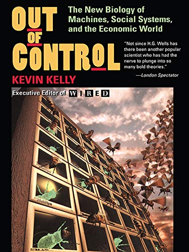

# Out of control

* "That is, the more **mechanical** we make our fabricated environment, the more **biological** it will eventually have to be if it is to work at all."

* "**Milk cows** and **carrots**, therefore, are human inventions as much as **steam engines** and **gunpowder** are. But milk cows and carrots are more indicative of the kind of inventions humans will make in the future: products that are **grown** rather than **manufactured**."

* "Two concrete trends are happening: (1) Human-made things are behaving more lifelike, and (2) Life is becoming more **engineered**."

* "Ours may always be a **flashy** type of creativity, but there is something to be said for a **slow**, **wide** creativity of many dim parts working ceaselessly."

* "This is a universal law of vivisystems: higher-level complexities **cannot be inferred** by lower-level existences."

* "**Nothing** — no computer or mind, no means of mathematics, physics, or philosophy — can unravel the **emergent pattern** dissolved in the parts without actually playing it out."

* "The theorists put it this way: running a system is the quickest, shortest, and only sure method to discern emergent structures latent in it. There are no shortcuts to actually **“expressing”** a convoluted, nonlinear equation to discover what it does."

* "What is contained in a human that will **not emerge until** we are all interconnected by wires and politics?"

* "Retrieval from memory involves selecting out of a vast field of things what’s important and what is not important, emphasizing the important stuff, downplaying the unimportant. **That selection process is perception**."

* "**The core processes of cognition** are very, very tightly related to **perception**."

* "The problem with our robots today is that we don’t respect them. They are stuck in factories without windows, doing jobs that humans don’t want to do. **we take machines as slaves, but they are not that**."

* "you can’t have intelligence without **a society of mind**. we can **only get smart things from stupid things**."

* "The distributed mass of ricocheting impulses which form the foundation of intelligence forbid deterministic results for
a given starting point. Instead of **repeatable results**, outcomes are merely **probabilistic**."

* "There is **no explicit communication** between the behavior agents. all communication occurs through **observing the effects of actions** that other agents have on the external world."

* "The world itself becomes the 'central' controller; **the unmapped environment becomes the map**. Within this kind of organization, **very small amounts of computation** are needed to generate intelligent behaviors."

* "Tight coupling of sensors to actuators — **reflexes**, **not thinking**."

* "sparse communication — **watch results in the world**, not wires."

	

