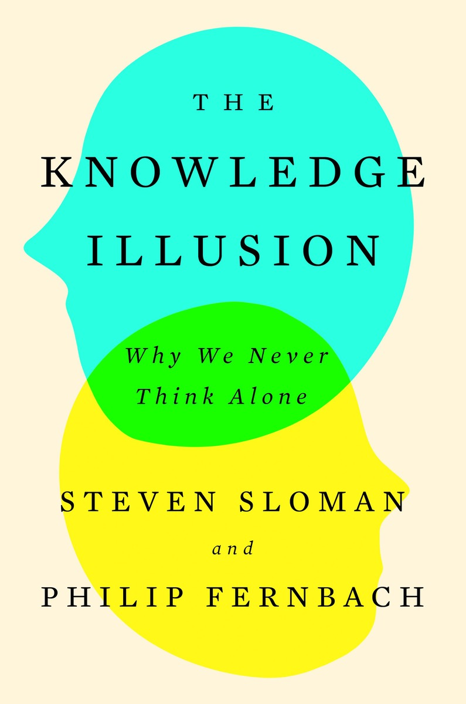

# The knowledge illusion

* "In fact, most knowledge is little more than a bunch of **associations**, high-level links between objects or people that aren't broken down into detailed stories."

* "Thought allows us to select from among a set of possible actions by predicting the effects of each action and by imagining how the world would be if we had taken different actions in the past."

* "In that sense, thought is an extension of action."

* "The secret to our success is that we live in a world in which knowledge is all around us. It is **in the things we make**, in our bodies and workspaces, and in other people. We live in **a community of knowledge**."

* "In the language of cognitive science, **we share intentionality**. In one form, it's called **playing**."

* "The nature of thought is to seamlessly draw on knowledge wherever it can be found, inside and outside of our own heads. We live under the knowledge illusion because we fail to draw an accurate line between what is inside and outside our heads."

* "No amount of understanding can **predict unknown unknowns**, and yet they occur all the time."

* "As soon as animals developed neurons and nervous systems, **the complexity of their actions** exploded and developed at a remarkable rate."

* "Being smart is all about having the ability to **extract deeper, more abstract information from the flood of data** that comes into our senses."

* "As a society, we **trade information about causal analysis** in a variety of ways."

* "Perhaps the most common way that people pass causal information to one another is by **storytelling**."

* "It's about what causes people to act and **how you can modify their motivations**, to make them think they're doing something for a different reason than they initially thought."

* "Thinking about **alternative possible worlds** is an important part of being human. It is called counterfactual thought."

* "A team of people cannot **intuit** something together, but they can **deliberate** together."

* "The visual environment functions as a sort of **outside memory store**."

	

