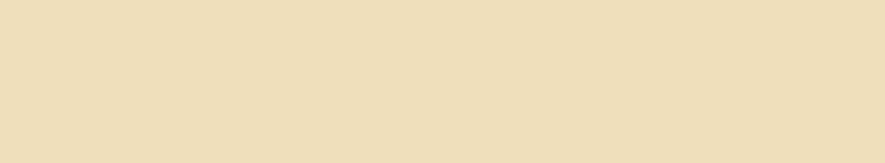
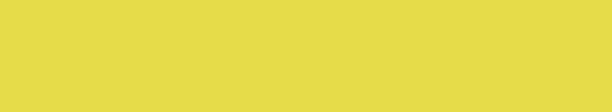
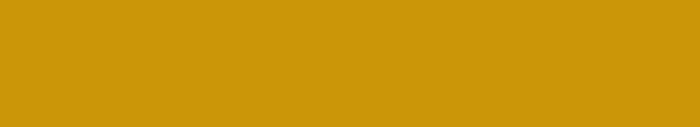
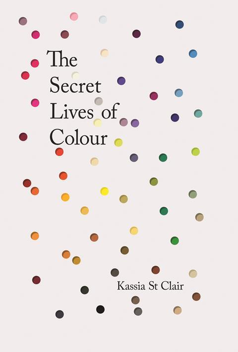

# The secret lives of color

## White

### Lead white

	

### Ivory

	

### Silver

	

### Whitewash

	

### Isabelline

	

### Chalk

	

### Beige

	

## White

### Blond

	

### Lead-tin yellow

	

### Indian yellow

	

### Acid yellow

	

### Naples yellow

	

### Chrome yellow

	

### Gamboge

	

### Orpiment

	

	

