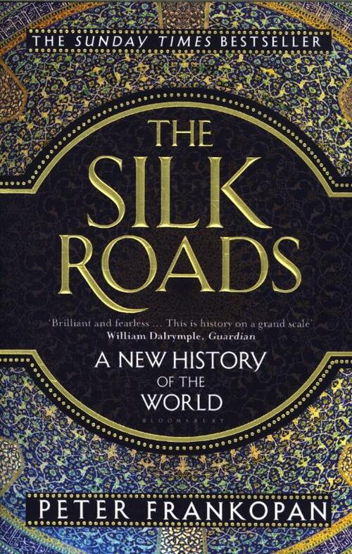

# The Silk Roads

* "religions had always played off each other in this region, and learnt that they had to **compete for attention**"

* "those who converted to Islam early were rewarded with a proportionately greater share of the prizes"

* "buildings and **material culture** were being used 'as a weapon for ideological conflict' during a volatile period of civil war"

* "an incentive that attracted the poor and persuaded them to accept the new faith"

* "slaves in the Muslim world were as ubiquitous and **silent** as they were in Rome"

* "control of the Silk Roads gave their masters access to information and ideas that could be replicated and deployed"

* "the age of empire and the rise of the west were built on the capacity to inflict violence on a major scale"

	

