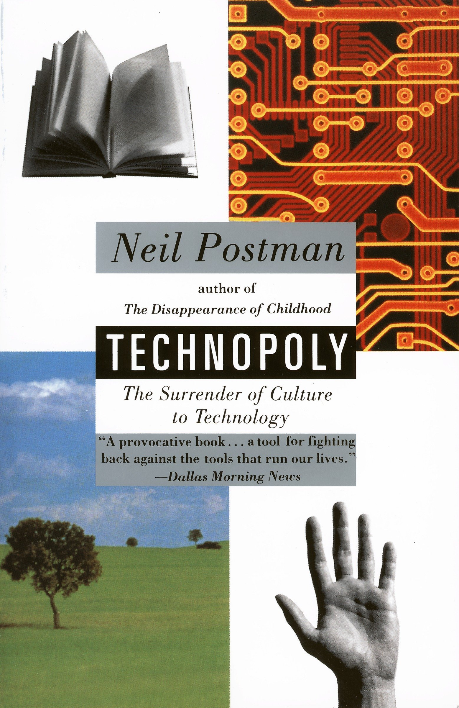

# The Surrender of Culture to Technology

* "our inventions are but **improved** means to an **unimproved** end"

* "social change of any kind is rarely seen as resulting in **winners** and **losers**"

* "a **number** can be given to the qualities of mercy, love, hate, beauty, creativity, intelligence, even sanity itself"

* "to a man with a hammer, everything looks like a nail; to a man with a computer, everything looks like data"

* "without the clock, capitalism would have been quite impossible"

* "new technologies compete with old ones - for time, for attention, for money, for prestige, but mostly for dominance of their **world-view**"

* "new technologies alter the structure of our interests: the things we **think about**. they alter the character of our symbols: the things we **think with**"

* "is it **lack of information** about how to grow food that keeps millions at starvation levels?"

* "schools were, in short, a means of governing the **ecology of information**"

* "so the priests of technopoly call sin 'social deviance', which is a statistical concept"

* "sin and evil disappear because they cannot be measured and objectified, and therefore cannot be dealt with by experts"

	

