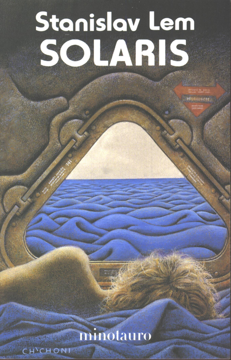

# Solaris

* "In fact, by no means everybody was yet convinced that the ocean was actually a living 'creature', and still less, it goes without saying, a **rational** one."

* "Also, by calling on the most abstruse branches of **statistical** analysis, it was possible to classify certain frequencies in the discharges of current."

* "We have no need of other worlds. We need **mirrors**. We don't know what to do with other worlds. A single world, our own, suffices us; but **we can't accept it** for what it is. We are searching for an **ideal** image of our own world; we go in quest of a planet, of a civilization superior to our own but developed on the basis of a prototype of our primeval past."

* "At the same time, there is something inside us which we don't like to face up to, from which we try to protect ourselves, but which nevertheless remains, since we don't leave Earth in a state of **primal innocence**."

* "Although these descriptions are unverifiable, since the ocean **seldom repeats itself**."

* "The freakish character and **gigantic scale** of these phenomena go too far outside the experience of man to be grasped by anybody observing them for the first time."

	

